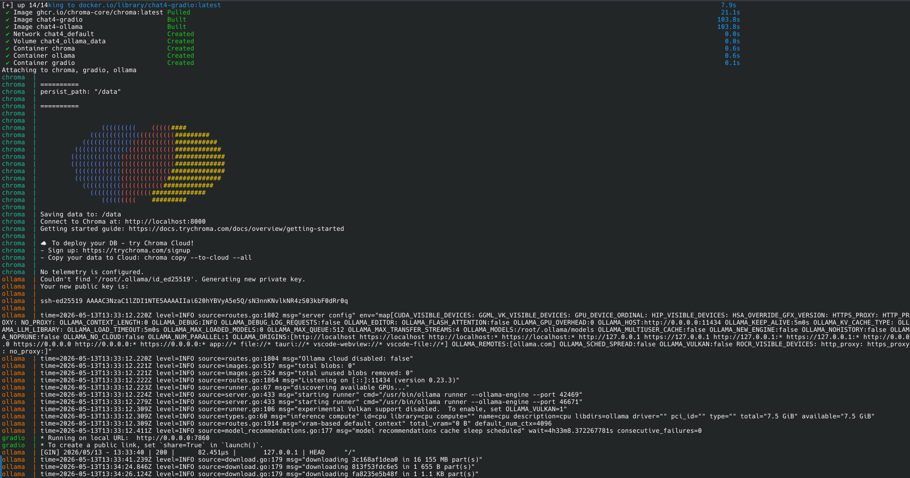
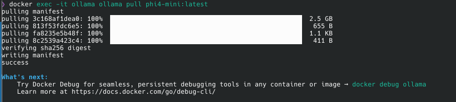
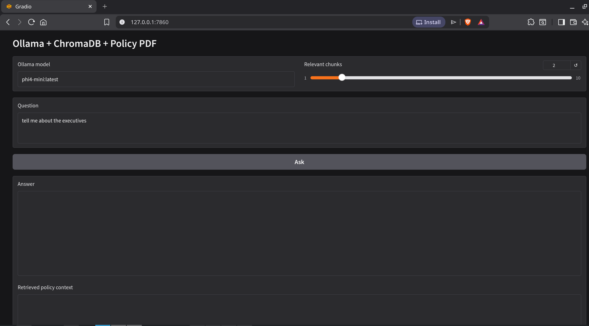

# AI-Security-and-Edge-AI-with-Small-Language-Models
AI Security and Edge AI (Security implications with Small Language Models in IoT)

## Intro
This simple lab illustrates the security implications around:
-  Data
- AI Models

## Pre-Requisites
- Docker
- Docker Compose

Using `docker compose` and `Dockerfile` to create:
- Chroma (backend / local database)
- Gradio (web front end)
- Ollama (middleware to manage `small language model`)

## Images Used
ghcr.io/chroma-core/chroma:1.5.9
ollama/ollama:0.23.3

## Steps
### Terminal 1
Open a terminal and change directory to the cloned repo
```bash
cd ./AI-Security-and-Edge-AI-with-Small-Language-Models 
docker compose up --build
```
You should see the following output


### Terminal 2
Once the docker build has been completed, open another terminal and pull a Small Language Model (SLM) using ollama
```bash
docker exec -it ollama ollama pull phi4-mini:latest
```
You should see the following output


### Web Browser
Open a browser and with the following URL
```bash
http://127.0.0.1:7860
```
example
You should see the following output


### Terminal 1
To destroy the environment
```bash
CRTL + C
docker compose down
```

## Discussion
### Here are a few questions to think about whilst playing with the lab
1) Data
- Can data be masked ?
  - Can sections of data be masked ?
- Is the data encrypted during rest ?
- Is the data encrypted during queries ?
- Who is allowed access to the data ?
- Can the data be moved / transferred ?
- Can the data be exposed externally ?
- Can you audit user / model actions ?
- Can the data be manipulated ?
- Is the data backed up ?
  - Security around the backup ?

2) Web Front End
- Can you lock down Authentication and Authorization ?
  - Is it secure ?
- Is the application secure ?
- Can data be copied ?
- Can user actions be audited ?
- Are the binaries secure ?
- Is traffic locked down ?
  - TLS used / version ?
  - Is the network inspected / gated ?

3) Middleware
- Small Language Model
  - What has it been trained on ?
    - What was the last trained date ?
  - Does it hallucinate ?
  - Does it perform with the resources provided ?
  - Is it secure ?
    - Spoofed ?
    - Attacked ?
    - Expose sensitive data ?
  - Is it fine tuned ?
  - Is it managed or local ?
    - Managed 
      - How many tokens are being consumed ?
      - Can your data be exposed ?
    - Local - is it secure ?
  - Are you using the correct settings ?
    - System prompt / User prompt ?
- Binaries
  - Open sourced or licensed ?
    - What are the security implications ?
  - Are any ports exposed ?


